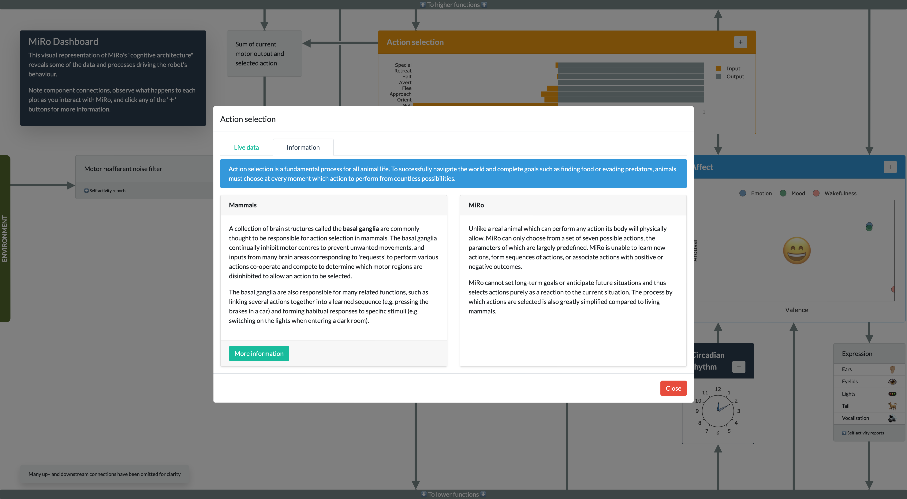

# MiRo dashboard

Interactive web dashboard displaying MiRo-E cognitive architecture with live data displays


[MiRo](https://www.miro-e.com) is a biomimetic robot mammal with a cognitive architecture based on the mammalian brain (Mitchinson & Prescott, 2016). However, it is not normally possible to access the data and processes underlying this architecture that give rise to the robot's behaviour.

The MiRo dashboard allows users to observe the activity of these systems during interactions with the robot, giving insight into the robot's actions and reactions. The dashboard also features short informational overlays to explain the similarities and differences between key aspects of MiRo's cognitive architecture and those of a real mammal.



## Installation

This version of the dashboard was adapted for use with Python3 and assumes you are running [MDK v230105](http://labs.consequentialrobotics.com/miro-e/software/) (or later).

You will also need to install `dash`, `dash-daq`, and `dash-bootstrap-components` for the web frontend, and `opencv-python-headless` for image processing. It's assumed you already have MDK prerequisites including `rospy` installed.

You can paste the following code snippet into the terminal for semi-automate installation process.

```bash
pip3 install dash dash-daq dash-bootstrap-components opencv-python-headless
cd ~/mdk/share/python/miro2/
git clone https://github.com/MiRo-projects/dashboard
```

## Usage

The server can be started by running `python3 index.py` inside `mdk/share/python/miro2/dashboard`.

``` bash
cd ~/mdk/share/python/miro2/dashboard
python3 index.py
```

The dashboard will be available at [localhost:8050](http://localhost:8050).

> **_NOTE:_**  If running inside WSL, this has to be replaced with the IP address of your WSL instance.

The server checks for a running ROS core, either in simulation or on a physical MiRo robot.

In either case, be sure to put MiRo in the '**autonomous mode**', otherwise the dashboard output won't be very interesting.
When running in simulation, it is advised to introduce some stimuli in the environment, such as the moving ball, otherwise MiRo will quickly go to sleep.

The biomimetic controller on the physical MiRo can be enabled through the MiRoApp.
Alternatively, it can be enabled through the terminal, both in simulation and for the physical MiRos:

* [Terminal Tab 1] Start the core controller

    ```bash
    cd ~/mdk/share/python/miro2/core
    python3 client_demo.py
    ```

* [Terminal Tab 2] Connect the left camera

    ```bash
    cd ~/mdk/share/python/miro2/core
    python3 client_demo.py - caml
    ```

* [Terminal Tab 3] Connect the right camera

    ```bash
    cd ~/mdk/share/python/miro2/core
    python3 client_demo.py - camr
    ```

* [Terminal Tab 4] Connect the microphones

    ```bash
    cd ~/mdk/share/python/miro2/core
    python3 client_demo.py - mics
    ```

## Links

* [Plotly Dash](https://dash.plot.ly)
* [Dash Bootstrap components](https://dash-bootstrap-components.opensource.faculty.ai)

## References

Buxton, D. R., Kerdegari, H., Mokaram, S., Mitchinson, B., & Prescott, T. J. (2019). A Window into the Robot ‘mind’: Using a Graphical Real-Time Display to Provide Transparency of Function in a Brain-Based Robot. In U. Martinez-Hernandez, V. Vouloutsi, A. Mura, M. Mangan, M. Asada, T. J. Prescott, & P. F. M. J. Verschure (Eds.), *Biomimetic and Biohybrid Systems* (pp. 316–320). Springer International Publishing. https://doi.org/10.1007/978-3-030-24741-6_28

Mitchinson, B., & Prescott, T. J. (2016). MIRO: A Robot 'Mammal' with a Biomimetic Brain-Based Control System. In N. F. Lepora, A. Mura, M. Mangan, P. F. M. J. Verschure, M. Desmulliez, & T. J. Prescott (Eds.), *Biomimetic and Biohybrid Systems* (Vol. 9793, pp. 179–191). Springer International Publishing. https://doi.org/10.1007/978-3-319-42417-0_17

## Acknowledgements

Dashboard design and code by David Buxton, based on the original [MiRo GUI](https://github.com/hamidehkerdegari/graphical_interface) by Hamideh Kerdegari.
